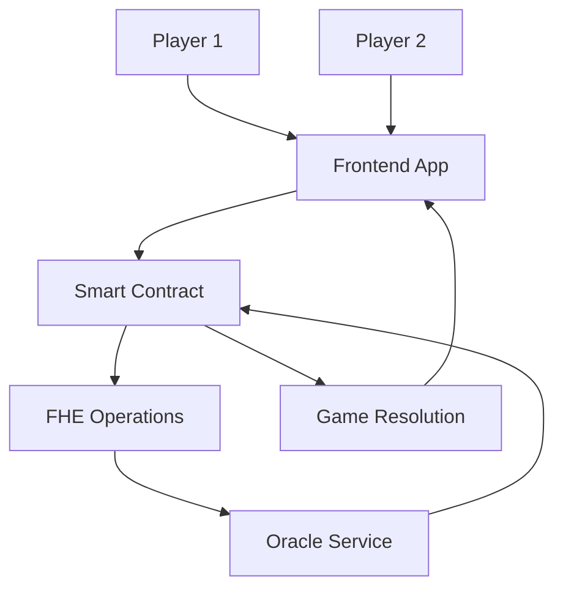
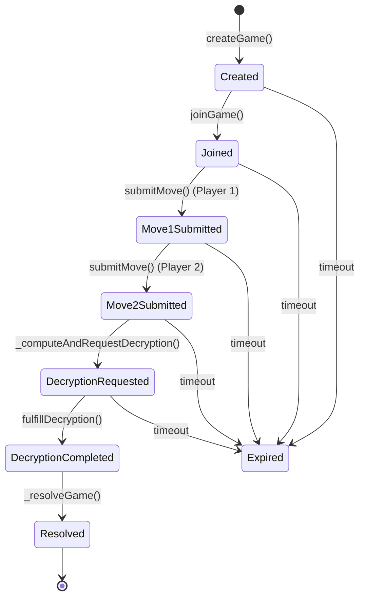
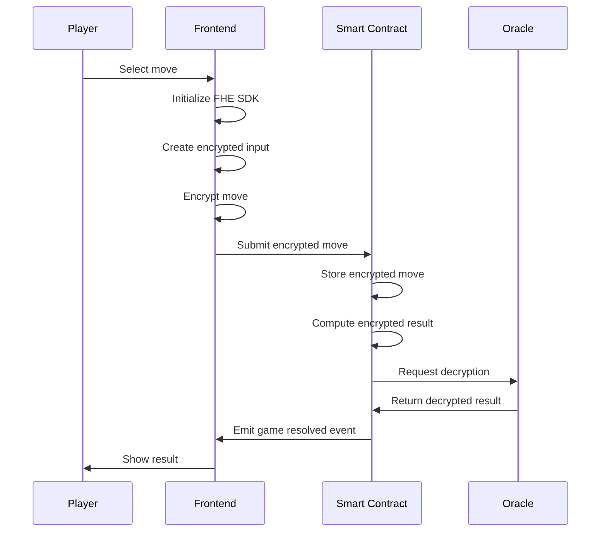

# 🏗️ System Architecture

This document describes the technical architecture of the Rock Paper Scissors FHE Game, including smart contract design, frontend architecture, and FHE integration.

## 📋 Table of Contents

- [Overview](#overview)
- [Smart Contract Architecture](#smart-contract-architecture)
- [Frontend Architecture](#frontend-architecture)
- [FHE Integration](#fhe-integration)
- [Data Flow](#data-flow)
- [Security Model](#security-model)
- [Performance Considerations](#performance-considerations)

## 🎯 Overview

The system consists of three main components:

1. **Smart Contract**: Handles game logic using FHE operations
2. **Frontend**: React application for user interaction
3. **Oracle Service**: External decryption service for FHE results



## 🔗 Smart Contract Architecture

### Contract Structure

```solidity
contract RockPaperScissorsGame_FHE_ResultOnly is 
    SepoliaConfig, 
    ReentrancyGuard, 
    Ownable {
    
    // Core game state
    mapping(uint256 => Game) public games;
    uint256 public gameIdCounter;
    
    // FHE operations
    function _computeResultFHEInternal(euint8 m1, euint8 m2) internal returns (euint8)
    function fulfillDecryption(uint256 requestId, bytes memory cleartexts, bytes memory decryptionProof) external
    
    // Game lifecycle
    function createGame(externalEuint8 encryptedMove, bytes memory proof, uint256 moveDeadline, uint256 betAmount) external payable
    function joinGame(uint256 gameId, externalEuint8 encryptedMove, bytes memory proof) external payable
    function submitMove(uint256 gameId, externalEuint8 encryptedMove, bytes memory proof) external
}
```

### Key Design Patterns

#### 1. State Management
- **Game Struct**: Comprehensive game state tracking
- **Mappings**: Efficient data access patterns
- **Events**: Decentralized state synchronization

#### 2. Security Patterns
- **ReentrancyGuard**: Prevents reentrancy attacks
- **Ownable**: Access control for admin functions
- **Pausable**: Emergency stop functionality
- **Signature Verification**: Oracle authenticity

#### 3. Gas Optimization
- **Batch Operations**: Multiple games processed together
- **Efficient Storage**: Packed structs and mappings
- **Event-Driven**: Minimal on-chain data storage

### Game State Machine



## 🎨 Frontend Architecture

### Component Hierarchy

```
App
├── Header
│   ├── WalletConnect
│   └── WithdrawModal
├── GamePanel
│   ├── GameInterface
│   └── GameList
└── Footer
```

### State Management

```javascript
// Global state
const [account, setAccount] = useState(null);
const [provider, setProvider] = useState(null);
const [contract, setContract] = useState(null);
const [balance, setBalance] = useState('0');

// FHE state
const [fheInitialized, setFheInitialized] = useState(false);
const [fheError, setFheError] = useState(null);
```

### Key Components

#### 1. Wallet Integration
- **Ethers.js v6**: Modern blockchain interaction
- **MetaMask**: Primary wallet provider
- **Network Detection**: Automatic network switching
- **Balance Tracking**: Real-time balance updates

#### 2. FHE Integration
- **Dynamic Import**: CDN-based SDK loading
- **Encryption Service**: Client-side move encryption
- **Decryption Service**: Oracle result decryption
- **Error Handling**: Comprehensive error management

#### 3. UI Components
- **Responsive Design**: Mobile-first approach
- **Loading States**: User feedback during operations
- **Error Messages**: Clear error communication
- **Real-time Updates**: Event-driven UI updates

## 🔐 FHE Integration

### Encryption Flow



### FHE Operations

#### 1. Client-Side Encryption
```javascript
// Initialize FHE instance
const fhe = await initializeFheInstance();

// Create encrypted input
const buffer = fhe.createEncryptedInput(contractAddress, userAddress);
buffer.add8(Number(move));

// Encrypt and get handles
const ciphertexts = await buffer.encrypt();
```

#### 2. Smart Contract FHE
```solidity
// Compute encrypted result
function _computeResultFHEInternal(euint8 m1, euint8 m2) internal returns (euint8) {
    // Check for draw
    ebool isEq = FHE.eq(m1, m2);
    
    // Check Player 1 wins
    ebool win1 = FHE.and(FHE.eq(m1, ROCK), FHE.eq(m2, SCISSORS));
    ebool win2 = FHE.and(FHE.eq(m1, PAPER), FHE.eq(m2, ROCK));
    ebool win3 = FHE.and(FHE.eq(m1, SCISSORS), FHE.eq(m2, PAPER));
    ebool p1Wins = FHE.or(FHE.or(win1, win2), win3);
    
    // Return encrypted result
    euint8 resP1orP2 = p1Wins.select(PLAYER1_WINS, PLAYER2_WINS);
    return isEq.select(DRAW, resP1orP2);
}
```

#### 3. Oracle Decryption
```solidity
function fulfillDecryption(
    uint256 requestId,
    bytes memory cleartexts,
    bytes memory decryptionProof
) external {
    // Verify signatures
    FHE.checkSignatures(requestId, cleartexts, decryptionProof);
    
    // Decode result
    (uint8 resultCode) = abi.decode(cleartexts, (uint8));
    
    // Process result
    _resolveGame(gameId, resultCode);
}
```

## 📊 Data Flow

### Game Creation Flow

1. **Player 1** selects move and bet amount
2. **Frontend** encrypts move using FHE SDK
3. **Smart Contract** stores encrypted move and creates game
4. **Event** emitted for game creation
5. **Frontend** updates UI with new game

### Game Joining Flow

1. **Player 2** browses available games
2. **Player 2** selects game and submits encrypted move
3. **Smart Contract** validates and stores second move
4. **Smart Contract** triggers FHE computation
5. **Oracle** decrypts result and returns to contract
6. **Smart Contract** resolves game and processes payouts

### Event-Driven Updates

```javascript
// Listen for game events
contract.on('GameCreated', (gameId, player1, betAmount) => {
    updateGameList();
});

contract.on('GameResolved', (gameId, resultCode, winner, totalPot) => {
    updateGameStatus(gameId);
    updatePlayerBalance();
});
```

## 🔒 Security Model

### Smart Contract Security

#### 1. Access Control
- **Ownable**: Admin functions protected
- **Game Players**: Only game participants can submit moves
- **Oracle**: Only authorized oracle can fulfill decryption

#### 2. Reentrancy Protection
- **ReentrancyGuard**: Prevents reentrancy attacks
- **Checks-Effects-Interactions**: Safe state updates
- **External Calls**: Limited and controlled

#### 3. Input Validation
- **Game ID**: Valid game existence checks
- **Move Values**: Valid move range (0-2)
- **Deadlines**: Time-based validation
- **Signatures**: Cryptographic verification

### FHE Security

#### 1. Encryption Security
- **Client-Side**: Moves encrypted before submission
- **Zero-Knowledge**: Moves never revealed in plaintext
- **Proof Verification**: Cryptographic proof validation

#### 2. Oracle Security
- **Signature Verification**: Oracle authenticity
- **Replay Protection**: Request ID validation
- **Timeout Protection**: Decryption deadline enforcement

#### 3. Privacy Guarantees
- **Complete Privacy**: Player moves never revealed
- **Fair Computation**: Game logic runs on encrypted data
- **Transparent Resolution**: Results are verifiable

## ⚡ Performance Considerations

### Gas Optimization

#### 1. Storage Optimization
- **Packed Structs**: Efficient storage layout
- **Mappings**: O(1) data access
- **Events**: Minimal on-chain data

#### 2. Batch Operations
- **Batch Expiry**: Multiple games processed together
- **Efficient Loops**: Optimized iteration patterns
- **Gas Limits**: Considered in all operations

#### 3. FHE Operations
- **Minimal Computations**: Only necessary FHE operations
- **Efficient Algorithms**: Optimized game logic
- **Oracle Integration**: External decryption service

### Frontend Performance

#### 1. Bundle Optimization
- **Code Splitting**: Dynamic imports for FHE SDK
- **Tree Shaking**: Remove unused code
- **Compression**: Gzip compression enabled

#### 2. Runtime Performance
- **Lazy Loading**: Components loaded on demand
- **Memoization**: Expensive computations cached
- **Event Optimization**: Efficient event handling

#### 3. FHE Performance
- **SDK Loading**: Dynamic import for faster initial load
- **Error Handling**: Graceful degradation
- **User Feedback**: Clear loading states

## 🔧 Configuration

### Environment Variables

```env
# Contract Configuration
VITE_CONTRACT_ADDRESS=0xa83Fc9AF608EfE0D871ee8FBedE702220220C651
VITE_NETWORK=sepolia
VITE_RPC_URL=https://sepolia.infura.io/v3/YOUR_KEY

# FHE Configuration
VITE_FHE_SDK_URL=https://cdn.zama.ai/relayer-sdk-js/0.2.0/relayer-sdk-js.js
VITE_ORACLE_ENDPOINT=https://api.zama.ai/relayer

# UI Configuration
VITE_APP_NAME=Rock Paper Scissors FHE
VITE_APP_VERSION=1.0.0
```

### Smart Contract Configuration

```solidity
// Game parameters
uint256 public constant MOVE_DEADLINE = 300; // 5 minutes
uint256 public constant DECRYPT_DEADLINE = 600; // 10 minutes
uint256 public constant MIN_BET = 0.001 ether;
uint256 public constant MAX_BET = 0.1 ether;

// Fee structure
uint256 public constant PLATFORM_FEE_PERCENT = 250; // 2.5%
address public constant FEE_RECIPIENT = 0x...;
```

## 📈 Monitoring and Analytics

### Smart Contract Events

```solidity
event GameCreated(uint256 indexed gameId, address indexed player1, uint256 betAmount);
event GameJoined(uint256 indexed gameId, address indexed player2);
event GameResolved(uint256 indexed gameId, uint8 resultCode, address winner, uint256 totalPot);
event DecryptionCompleted(uint256 indexed gameId, uint256 requestId, uint8 resultCode, address winner);
```

### Frontend Analytics

```javascript
// Game metrics
const gameMetrics = {
    totalGames: 0,
    totalVolume: 0,
    averageGameTime: 0,
    successRate: 0
};

// FHE metrics
const fheMetrics = {
    encryptionTime: 0,
    decryptionTime: 0,
    errorRate: 0
};
```

## 🚀 Deployment Architecture

### Smart Contract Deployment

```bash
# Compile contracts
npx hardhat compile

# Deploy to Sepolia
npx hardhat run scripts/deploy.js --network sepolia

# Verify contract
npx hardhat verify --network sepolia <CONTRACT_ADDRESS>
```

### Frontend Deployment

```bash
# Build for production
npm run build

# Deploy to Vercel
vercel --prod

# Configure environment variables
vercel env add VITE_CONTRACT_ADDRESS
```

## 🔄 Future Architecture Considerations

### Scalability Improvements

1. **Layer 2 Integration**: Move to L2 for lower gas costs
2. **Batch Processing**: Process multiple games together
3. **Caching Layer**: Redis for frequently accessed data
4. **CDN Integration**: Global content delivery

### FHE Enhancements

1. **Advanced FHE**: More complex game logic
2. **Multi-Party Computation**: Multiple players per game
3. **Zero-Knowledge Proofs**: Additional privacy guarantees
4. **Custom FHE Circuits**: Optimized game logic

### Security Upgrades

1. **Formal Verification**: Mathematical proof of correctness
2. **Audit Integration**: Continuous security monitoring
3. **Bug Bounty**: Community security testing
4. **Insurance Integration**: DeFi insurance protocols

---

This architecture provides a solid foundation for private, fair, and scalable blockchain gaming using FHE technology. The modular design allows for easy extension and improvement while maintaining security and performance standards.
